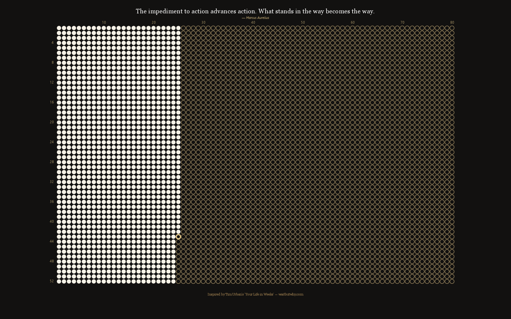

# 80Y-in-Weeks: Life Calendar Wallpaper Generator

A minimalist life calendar wallpaper generator that visualizes your life in weeks, inspired by the concept that the average human lifespan consists of about 80 years or 4,160 weeks.



## Features

- **Life in Weeks Visualization**: Displays your life as a grid of 4,160 weeks (80 years × 52 weeks)
- **Current Progress**: Highlights your current position in life based on your birthdate
- **Rotating Quotes**: Shows a different inspirational quote each week
- **Clean Design**: Minimalist aesthetic with proper spacing between elements
- **Precise Birthday Tracking**: Accurately calculates weeks until your next birthday
- **Automatic Scaling**: Adapts to your screen resolution for perfect display on any device
- **Auto Wallpaper Setting**: Sets your desktop wallpaper automatically
- **Scheduler**: Can be set to update daily or weekly

## Installation

1. Make sure you have [Node.js](https://nodejs.org/) installed
2. Clone or download this repository
3. Install dependencies:
   ```
   npm install
   ```

## Usage

### One-time Run

Simply run the script to generate and set the wallpaper:

```
npm start
```

### Schedule Automatic Updates

The application comes with a batch script to easily set up automatic updates:

1. For weekly updates on Monday at midnight (plus login detection):
   ```
   schedule_wallpaper.bat
   ```

When you run this script, it will:
- Check if you have administrative privileges (required for creating scheduled tasks)
- Automatically request elevated permissions via a UAC prompt if needed
- Create a Windows Task Scheduler entry that will update your wallpaper on Mondays at midnight

Additionally, if your computer was off during the scheduled time, the wallpaper will update when you next log in.

#### Manual Task Scheduling Options

You can also customize the schedule further by editing the batch file or creating a task manually:

- Change the update time (replace `00:00` with your preferred time)
- Change the update day for weekly updates (replace `MON` with `TUE`, `WED`, etc.)
- Add additional parameters like "run only when user is logged on"

To edit an existing task, open Task Scheduler and find "80Y-in-Weeks Life Calendar Wallpaper".

## Configuration

Edit the `config.json` file to customize your experience:

```json
{
  "birthdate": "YYYY-MM-DD",  // Your date of birth
  "theme": "dark",            // "dark" or "light"
  "quotes": [ ... ],          // Array of inspirational quotes
  "attributions": [ ... ]     // Array of quote attributions
}
```

## Design Details

The wallpaper features:

- **Grid Layout**: 80 years (columns) by 52 weeks (rows) visualizing a potential lifespan
- **Week Markers**: Numeric indicators for weeks positioned along the left side
- **Year Markers**: Decade indicators (10, 20, 30...) positioned at the top
- **Current Week**: Highlighted with a distinct empty circle with a thick border
- **Quote & Attribution**: Inspirational quote with attribution positioned above the grid
- **Perfect Spacing**: Carefully calculated spacing between all elements for visual clarity

## Testing & Development Features

### Testing Future Dates

You can simulate future dates to see how the wallpaper will look:

```
$env:TEST_DATE="YYYY-MM-DD"; npm run start
```

This allows you to verify that birthday calculations and week progression work correctly.

### Testing Different Screen Resolutions

Test how the wallpaper looks on various common screen resolutions:

```
$env:TEST_MULTIPLE_RESOLUTIONS="true"; npm run start
```

This generates test wallpapers for the top 10 most common screen resolutions and saves them in the `resolution_tests` directory.

### Testing Specific Resolutions

Test a specific screen resolution:

```
$env:TEST_RESOLUTION="1920x1080"; npm run start
```

### Combined Testing

You can combine date and resolution testing:

```
$env:TEST_DATE="2024-12-25"; $env:TEST_RESOLUTION="1920x1080"; npm run start
```

## How It Works

The script:

1. Calculates your age in weeks based on your birthdate
2. Precisely tracks progress toward your next birthday
3. Generates a visual grid where:
   - Filled circles represent weeks you've lived
   - The current week is an empty circle with a thicker border
   - Empty circles represent future weeks
4. Displays a weekly rotating inspirational quote with attribution
5. Automatically sets this image as your desktop wallpaper
6. When scheduled, updates automatically to show your progress through life

## Dependencies

- canvas: For generating the image
- win-wallpaper: For setting the Windows wallpaper

## Customization

- Edit the themes in `80Y-in-Weeks.js` to change colors
- Add or change quotes in `config.json`
- Modify the grid appearance by changing constants in the script

## Platform Support

This application is currently Windows-only due to:
- Windows-specific wallpaper setting mechanism
- Windows Task Scheduler integration
- Windows system calls for screen resolution detection

## Supported Screen Resolutions

The wallpaper has been tested and optimized for the top 10 most common screen resolutions globally:

1. 1920×1080 (16:9) - Standard monitors, laptops
2. 1366×768 (16:9) - Older laptops, budget monitors
3. 1536×864 (16:9) - Mid-range laptops
4. 1440×900 (16:10) - MacBooks, older widescreens
5. 1280×720 (16:9) - Entry-level displays
6. 1600×900 (16:9) - Mid-tier laptops
7. 2560×1440 (16:9) - High-end monitors, QHD displays
8. 1360×768 (16:9) - Similar to 1366x768 (older)
9. 1024×768 (4:3) - Legacy systems, embedded UIs
10. 1680×1050 (16:10) - Prosumer widescreen monitors

## License

MIT

## Acknowledgements

This project was inspired by Tim Urban’s viral “Your Life in Weeks” chart and Oliver Burkeman’s deeply reflective book Four Thousand Weeks, which I read and carried with me since. Both shaped how I view time, mortality, and meaning — and led to the creation of this visual tool.
